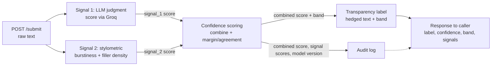
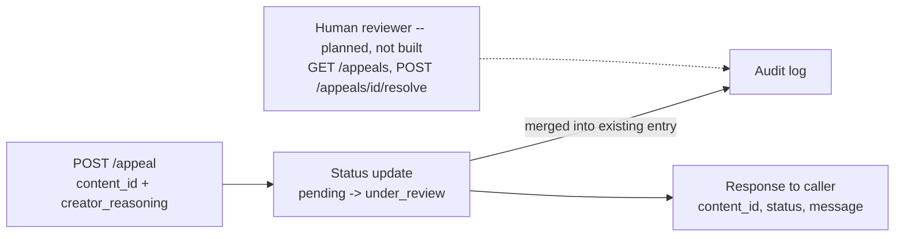

# ai201-project4-provenance-guard

Provenance Guard is a service that scores submitted text for likely AI involvement,
attaches a transparency label, and gives creators a way to appeal a label they
believe is wrong. This document is the Milestone 1 design: detection signals,
the false-positive/appeal reasoning, the API contract, and the architecture
diagram. No detection logic is implemented yet — this is the contract every
later milestone has to satisfy.

## 1. Detection signals

Two independent, cheap-to-compute signals. They're combined later into one
confidence score, but each is designed to fail in a *different* way so one
signal's blind spot doesn't silently become the system's blind spot.

### Signal 1 — LLM judgment score (model-based, via Groq)

- **What it measures:** A reference LLM's own stylistic judgment of how
  AI-like the text reads, reported directly as a 0–1 number. (Originally
  specced as raw perplexity via per-token `logprobs`; changed after
  confirming Groq doesn't support `logprobs`/`echo` on any hosted model, so
  token-level probabilities of arbitrary input text aren't obtainable
  through the API. See `planning.md` §1.1 for the implementation.)
- **Why it differs human vs. AI:** the same underlying intuition as
  perplexity — AI text tends to read as more predictable, generic, and
  structurally uniform than human writing — just judged by the model
  directly (via a style-only prompt) instead of computed from raw token
  probabilities.
- **Blind spot:** it inherits perplexity's failure population — formulaic
  human text (legal boilerplate, non-native-English academic writing,
  templated technical docs) reads as "predictable" to a judge model too, so
  it will false-positive on exactly that population. It also adds a new one:
  the score now depends on how the model interprets the judging prompt, so
  it can drift if the prompt wording changes, and it's a single model call
  with no raw statistic underneath to sanity-check against.

### Signal 2 — Stylometric composite (structural, local)

- **What it measures:** Two independent structural properties, combined into
  one score. **Burstiness**: the variance/standard deviation of sentence
  length across the document — how much the rhythm fluctuates. **Filler/
  casual-word density**: how often the text uses casual hedge words (`like`,
  `honestly`, `kinda`, `lol`, ...). Both computed locally, no API call. (Type-
  token ratio was tried as a second metric alongside burstiness but didn't
  discriminate at typical paragraph lengths — see `planning.md` §1.2 — filler
  density replaced it.)
- **Why it differs human vs. AI:** Human writing mirrors thought: short
  fragments next to long meandering sentences, asides, corrections, plus
  casual hedge words. A single LLM generation pass tends to produce more
  uniform sentence construction and skips casual filler words entirely.
- **Blind spot:** Same failure population as Signal 1 — technical writing,
  legal contracts, and non-native speakers following a template are
  naturally *low-burstiness* and filler-free even when human-written. It's
  also purely syntactic/lexical: it looks at sentence shape and word choice,
  not meaning, so it can't tell AI-drafted-then-heavily-edited text from
  purely human text if the editor varies sentence length or adds casual
  words. And it's easy to defeat by explicitly prompting an LLM to vary
  sentence length or write more casually.

**Design consequence:** both signals share the same false-positive
population (formulaic / non-native / domain-constrained human writers).
Combining them does not cancel that risk — it can compound it. This is why
confidence scoring and the appeal path (below) exist as first-class parts of
the system, not an afterthought.

## 2. False-positive walkthrough

Scenario: a non-native English speaker submits a genuinely human-written,
formulaic technical report. Signal 1 sees low perplexity (predictable
phrasing). Signal 2 sees low burstiness (uniform sentence length). Both
signals point the same wrong direction — this is the case the design has to
survive.

Trace through the system:

1. **Confidence score** — must never collapse to a single binary bit. Store
   the two raw signal scores *and* a combined score, and treat a case where
   both signals are only mildly over threshold (rather than overwhelmingly
   so) as **low-confidence**, not high-confidence-positive. Confidence
   reflects margin/agreement between signals, not just the combined score.
2. **Label** — must be hedged and probabilistic, never an assertion of fact:
   e.g. `"Signals suggest possible AI involvement (confidence: medium)"`,
   not `"This text is AI-generated."` A three-tier label
   (`likely-human` / `uncertain` / `likely-ai-assisted`) instead of a binary
   AI/human avoids manufacturing false certainty out of a shaky signal.
3. **Audit log** — every submission logs both raw signal scores, the
   combined score, the model/version used for Signal 1, and a timestamp —
   enough for a human reviewer to reconstruct *why* the label was given, not
   just what the label was.
4. **Appeal** — the creator files an appeal referencing the submission and an
   explanation. Critically, the appeal is **not** resolved by re-running the
   same two signals (that would just reproduce the same false positive) —
   it flips the submission to an `appealed` status and requires a human
   reviewer decision. The original algorithmic score/label stays visible
   (transparency), but the reviewer's resolution is a separate field that
   overrides what's *shown* to consumers of the label.

This is why Milestone 2 needs: a continuous confidence score with an
explicit uncertainty band, hedged label copy, a full audit-log schema, and
an appeal status machine that terminates in human adjudication rather than
another automated score.

## 3. API surface

**Implemented:**

| Endpoint | Method | Accepts | Returns |
|---|---|---|---|
| `/submit` | POST (rate-limited, §5) | `{ text, creator_id }` | `{ content_id, attribution, confidence, llm_score, stylometric_score, label }` |
| `/appeal` | POST | `{ content_id, creator_reasoning }` | `{ content_id, status: "under_review", message }` |
| `/log` | GET | `?limit=N` (optional) | `{ entries: [...] }` — newest-first audit log |

**Planned, not yet built** (§4.4/§4.5 of `planning.md` — reviewer queue and
human-adjudicated resolution):

| Endpoint | Method | Accepts | Returns |
|---|---|---|---|
| `/appeals?status=pending` | GET | — | reviewer queue: appeal + original classification, side by side |
| `/appeals/<id>/resolve` | POST (reviewer-only) | `{ decision: "upheld" \| "overturned", reviewer_notes }` | `{ status: "resolved", decision, resolved_at }` |

Notes:
- `attribution` is the uncertainty band (`likely-human` / `uncertain` /
  `likely-ai-assisted`); `label` is the full hedged sentence for that band
  (planning.md §3) — kept separate so the UI never has to invent hedging
  language itself.
- `/appeal` updates the *same* audit-log entry the original `/submit` call
  wrote (via `content_id`), rather than creating a disconnected record — see
  §6.
- The planned `/appeals/<id>/resolve` is the one place a human would override
  an algorithmic label; it must never be reachable by the same code path
  that computes signals.

## 4. Architecture diagram

### Submission flow



### Appeal flow



## 5. Rate limiting

`/submit` is limited to **10 requests/minute and 100/day per client
(IP-keyed)**, via `flask-limiter` with in-memory storage.

- **10/minute**: a real writer submitting their own work — checking a draft,
  revising, resubmitting — realistically fires a handful of requests in a
  burst, not ten-plus in a single minute. 10/minute is generous headroom for
  that pattern while still stopping a naive flood script cold, and it caps
  how many Groq calls (§1.1) a single client can trigger per minute, which
  matters since each `/submit` costs a live model call.
- **100/day**: covers a genuinely heavy user submitting many pieces over a
  full day (a class grading a stack of essays, a moderation queue clearing
  backlog) without requiring a limit increase, while still bounding the
  worst case cost of one client hammering the endpoint all day.

Verified with the 12-rapid-request test (first 10 succeed, remainder
rejected):

```
200
200
200
200
200
200
200
200
200
200
429
429
```

## 6. Audit log

Every `/submit` call writes one structured entry (`audit_log.py`, persisted
to `audit_log.json`, not console output) containing: `timestamp`,
`content_id`, `creator_id`, `attribution`, `confidence`, `llm_score`,
`stylometric_score`, `disagreement`, `low_coverage`, and `status`. Filing an
appeal (`/appeal`) updates that *same* entry in place — `status` flips to
`under_review` and `appeal_reasoning`/`appeal_timestamp` are added — so
whether an appeal has been filed is visible directly on the entry, not in a
disconnected record. Example, from `GET /log` (newest first):

```json
{
  "entries": [
    {
      "attribution": "uncertain",
      "confidence": 0.535,
      "content_id": "5b719fa8-b203-4136-af3b-3279b611728e",
      "creator_id": "label-test-mid",
      "disagreement": 0,
      "llm_score": 0.55,
      "low_coverage": true,
      "status": "classified",
      "stylometric_score": null,
      "timestamp": "2026-07-01T05:09:30.303Z"
    },
    {
      "attribution": "likely-human",
      "confidence": 0.1947,
      "content_id": "12aa2230-0a47-40a0-878e-cee1dbdd98da",
      "creator_id": "label-test-human",
      "disagreement": 0.0769,
      "llm_score": 0.2,
      "low_coverage": false,
      "status": "classified",
      "stylometric_score": 0.12310268179265248,
      "timestamp": "2026-07-01T05:09:29.721Z"
    },
    {
      "appeal_reasoning": "I wrote this myself from personal experience. I am a non-native English speaker and my writing style may appear more formal than typical.",
      "appeal_timestamp": "2026-07-01T05:09:57.074Z",
      "attribution": "likely-ai-assisted",
      "confidence": 0.8648,
      "content_id": "46055383-5963-4a72-a363-92bcc48570ed",
      "creator_id": "label-test-ai",
      "disagreement": 0.045,
      "llm_score": 0.9,
      "low_coverage": false,
      "status": "under_review",
      "stylometric_score": 0.8550221338768422,
      "timestamp": "2026-07-01T05:09:29.121Z"
    }
  ]
}
```

The third entry shows the appeal case: `status: "under_review"` and
`appeal_reasoning` populated, sitting alongside the original classification
fields from the same submission.
