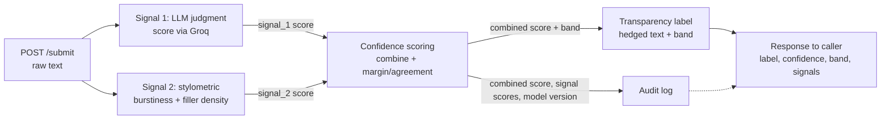
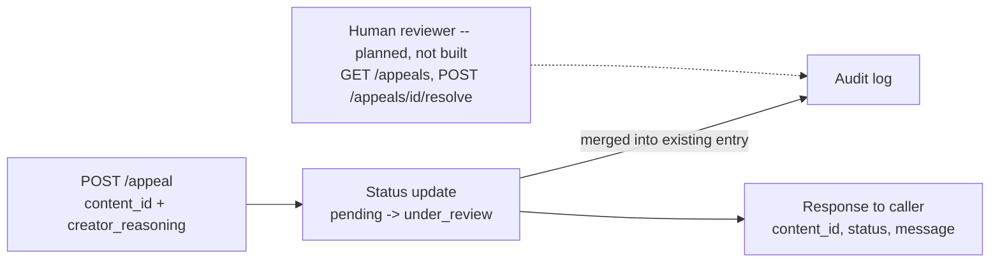

# Provenance Guard

Provenance Guard is a service that scores submitted text for likely AI
involvement, attaches a transparency label, and gives creators a way to
appeal a label they believe is wrong. It runs on Flask, uses Groq as an LLM
judge for one detection signal, and computes a second signal purely locally.
Full implementation-level spec — exact formulas, thresholds, label copy,
appeal state machine — lives in [`planning.md`](planning.md); this document
is the project writeup: what was built, why, and where it's weakest.

## 1. Detection signals

Two independent signals, each normalized to 0–1 (higher = more AI-like),
combined into one confidence score. They were chosen to fail in *different*
ways, so one signal's blind spot doesn't silently become the whole system's
blind spot.

### Signal 1 — LLM judgment score (via Groq)

Sends the text to Groq with a system prompt instructing the model to judge
writing style only (not content correctness) and return a single 0–1 number,
enforced with structured JSON output so the response always parses.

**Why this signal:** AI-generated text is produced by sampling from a
language model's own probability distribution, so a model judging "does this
read like something I'd generate" has direct access to exactly the property
that matters — predictability of word choice, generic phrasing, formulaic
transitions. This was originally specced as raw perplexity computed from
per-token log-probabilities (a more classical, self-contained statistical
approach), but Groq doesn't expose `logprobs`/`echo` on any hosted model, so
token-level probabilities of arbitrary input text aren't obtainable through
the API. The LLM-judgment approach keeps the same underlying intuition and
the same role in the pipeline, just asks the model to report its own
judgment directly instead of computing perplexity out of raw numbers.

**Blind spot:** it inherits perplexity's failure population — formulaic
human text (legal boilerplate, non-native-English academic writing,
templated technical docs) reads as "predictable" to a judge model too, so it
false-positives on exactly that population. It also adds a new one: the
score depends on how the model interprets the judging prompt, so it can
drift if the wording changes, and — because it's a single model call with no
raw statistic underneath — there's nothing to sanity-check it against when
it's wrong. Testing also surfaced real run-to-run variance at
`temperature=0` (the same input scored `0.65` on one call and `0.7` on
another three calls in a row) — Groq's inference isn't perfectly
deterministic even pinned to zero temperature.

### Signal 2 — Stylometric composite (local, no API call)

Combines two structural/lexical metrics into one score: **burstiness**
(coefficient of variation of sentence length — how uniform vs. bursty the
rhythm is) and **filler/casual-word density** (how often the text uses
casual hedge words like `like`, `honestly`, `kinda`, `lol`).

**Why this signal:** it's the deliberate complement to Signal 1 — cheap,
instant, offline, and looks at *form* rather than content, so it fails
independently of whatever might be wrong with the model judge (a bad prompt,
an API outage, model drift). Burstiness was the original spec. A second
metric was added during Milestone 4 testing: type-token ratio was tried
first (the standard second stylometric feature) but measured flat — 0.86 to
0.90 — across four hand-picked test paragraphs of typical submission length,
because there isn't enough text at 40–55 words for word-repetition patterns
to show up. Filler-word density, measured on the same four paragraphs,
actually separated the casual sample (`0.091`) from the three formal-register
ones (`0.000`), so it replaced TTR. That's a concrete example of testing a
design choice against real inputs before committing to it, rather than
picking a textbook metric and assuming it would work at this text length.

**Blind spot:** same failure population as Signal 1 — technical writing,
legal contracts, and non-native speakers following a template are naturally
low-burstiness and filler-free even when human-written. It's also purely
syntactic/lexical, not semantic: it can't tell AI-drafted-then-heavily-edited
text from purely human text if the editor varies sentence length or adds
casual words, and it's easy to defeat by explicitly prompting an LLM to vary
sentence length or write more casually. The filler-word list itself is a
narrow, English-internet-casual register (`like`, `lol`, `kinda`) — human
writing that's casual in a different register (other dialects, other
languages, other generations' slang) won't trigger it and will read as
falsely "formal" to this signal.

**Design consequence:** both signals share the same false-positive
population (formulaic / non-native / domain-constrained human writers).
Combining them does not cancel that risk — it can compound it, which is why
confidence scoring and the appeal path exist as first-class parts of the
system rather than an afterthought.

**What I'd change for a real deployment:**
- Replace the placeholder calibration constants (`PPL`-style thresholds for
  Signal 2, the AI/human band cutoffs) with values fit against an actual
  labeled dataset of known-human and known-AI text, instead of the four
  hand-picked examples used here. Everything in this repo is honest about
  that gap (see §6), but it's the single highest-leverage fix.
- Add a real perplexity/burstiness-of-probability signal from a local
  open-weight model, once one is available with usable logprobs, as a third
  signal — Signal 1's current LLM-judgment approach and Signal 2's structural
  approach are both somewhat coarse; a genuine statistical signal would give
  the ensemble a third, differently-shaped failure mode.
- Expand the filler-word list past a single casual-English-internet register,
  or replace it with something register-agnostic.
- Move `SUBMISSIONS` and the audit log off in-memory dict / single JSON file
  onto a real database — the current audit log is read-and-rewrite-the-whole-
  file on every append, which doesn't scale past a toy deployment and isn't
  safe under concurrent writers.

## 2. Confidence scoring

`combine_scores(s1, s2)` (see `planning.md` §1.3) does a weighted average
(`0.6 * s1 + 0.4 * s2`, Signal 1 weighted higher as the more direct signal),
then pulls the result *toward 0.5* in proportion to how much the two signals
disagree, and pulls it toward 0.5 again (less aggressively) if only one
signal was available at all (e.g. text too short for Signal 2).

**Why this approach, not a plain average or a trained classifier:** with no
labeled dataset, training a classifier would just be curve-fitting on a
handful of examples and calling it a model — worse than being honest that
this is a hand-specified heuristic. A hand-specified formula is also fully
auditable: given any `confidence_score`, you can trace exactly which numbers
produced it, which matters enormously for a system whose entire purpose is
to explain itself when a creator appeals. The disagreement-damping is the
deliberate part: if the two signals point in different directions, that
disagreement is itself information (more uncertainty), and a naive average
would silently launder that disagreement into a falsely-confident-looking
middle score instead of surfacing it as `uncertain`.

**Two examples showing meaningful variation** (both real runs, from
Milestone 4/5 testing — not constructed to look good):

- **High confidence (AI):** `"The system processes incoming requests
  efficiently. The system validates all input data carefully. The system
  logs every transaction automatically. The system generates reports on
  schedule."` — `llm_score = 0.90`, `stylometric_score = 0.855`, disagreement
  only `0.045` (the two signals agree strongly), **`confidence_score =
  0.8648`** → band `likely-ai-assisted`.
- **Lower confidence (uncertain):** `"I've been thinking a lot about remote
  work lately. There are genuine tradeoffs — flexibility and no commute on
  one side, isolation and blurred work-life boundaries on the other. Studies
  show productivity varies widely by individual and role type."` (a
  lightly-edited-AI-style borderline case) — `llm_score = 0.20`,
  `stylometric_score = 0.5615`, disagreement `0.3615` (the two signals
  disagree substantially — Signal 1 reads it as human-ish, Signal 2 reads
  the sentence structure as fairly uniform), **`confidence_score = 0.4008`**
  → band `uncertain`.

The gap between `0.86` and `0.40` on two real submissions is the point: the
score is not a constant, and the second example's lower confidence is
directly explainable by signal disagreement, not just "a number in the
middle."

## 3. Transparency labels

Three exact variants (`labels.py`, copied verbatim from `planning.md` §3 —
no free text is generated per request, so the hedging language can't drift):

**High-confidence AI** (`likely-ai-assisted`, `confidence_score >= 0.70`):
> "Our automated signals indicate a high likelihood of AI involvement in this
> text (AI-likelihood score: 0.86). This is a probabilistic signal, not a
> factual determination -- the creator may appeal this label."

**Uncertain** (`uncertain`, `0.30 < confidence_score < 0.70`):
> "Our automated signals were inconclusive about AI involvement in this text
> (AI-likelihood score: 0.40). No determination has been made, and no
> restriction is applied based on this score alone."

**High-confidence human** (`likely-human`, `confidence_score <= 0.30`):
> "Our automated signals did not find strong indicators of AI involvement in
> this text (AI-likelihood score: 0.19)."

Only the AI-assisted variant mentions the appeal path — the other two labels
don't impose anything on the creator to contest, so surfacing "you may
appeal" there would be noise. All three were verified programmatically
against the spec (correct substrings, correct score interpolation, all three
mutually distinct) before being wired into `/submit`, and confirmed reachable
live by submitting three inputs that land in each band.

## 4. Appeals workflow

`POST /appeal` accepts `{ content_id, creator_reasoning }`. It updates that
submission's status to `under_review` and merges the appeal directly into
the *existing* audit-log entry for that `content_id` (rather than creating a
disconnected record), so the appeal sits alongside the original
`attribution`/`confidence`/signal scores in one place. No signal is
re-run — re-scoring with the same two heuristics would just reproduce
whatever mistake triggered the appeal. One open appeal per `content_id` at a
time (`409` on a second attempt); unknown `content_id` returns `404`. A
reviewer queue and human-adjudicated resolution endpoint are specced
(`planning.md` §4.4/§4.5) but not built — see §6.

## 5. Rate limiting

`/submit` is limited to **10 requests/minute and 100/day per client
(IP-keyed)**, via `flask-limiter` with in-memory storage.

- **10/minute**: a real writer submitting their own work — checking a draft,
  revising, resubmitting — realistically fires a handful of requests in a
  burst, not ten-plus in a single minute. 10/minute is generous headroom for
  that pattern while still stopping a naive flood script cold, and it caps
  how many Groq calls a single client can trigger per minute, which matters
  since each `/submit` costs a live model call.
- **100/day**: covers a genuinely heavy user submitting many pieces over a
  full day (a class grading a stack of essays, a moderation queue clearing
  backlog) without requiring a limit increase, while still bounding the
  worst-case cost of one client hammering the endpoint all day.

Verified with a 12-rapid-request test (first 10 succeed, remainder
rejected):

```
200
200
200
200
200
200
200
200
200
200
429
429
```

## 6. Audit log

Every `/submit` call writes one structured entry (`audit_log.py`, persisted
to `audit_log.json`, not console output) containing: `timestamp`,
`content_id`, `creator_id`, `attribution`, `confidence`, `llm_score`,
`stylometric_score`, `disagreement`, `low_coverage`, and `status`. Filing an
appeal updates that *same* entry in place — `status` flips to `under_review`
and `appeal_reasoning`/`appeal_timestamp` are added — so whether an appeal
has been filed is visible directly on the entry. Example, from `GET /log`
(newest first):

```json
{
  "entries": [
    {
      "attribution": "uncertain",
      "confidence": 0.535,
      "content_id": "5b719fa8-b203-4136-af3b-3279b611728e",
      "creator_id": "label-test-mid",
      "disagreement": 0,
      "llm_score": 0.55,
      "low_coverage": true,
      "status": "classified",
      "stylometric_score": null,
      "timestamp": "2026-07-01T05:09:30.303Z"
    },
    {
      "attribution": "likely-human",
      "confidence": 0.1947,
      "content_id": "12aa2230-0a47-40a0-878e-cee1dbdd98da",
      "creator_id": "label-test-human",
      "disagreement": 0.0769,
      "llm_score": 0.2,
      "low_coverage": false,
      "status": "classified",
      "stylometric_score": 0.12310268179265248,
      "timestamp": "2026-07-01T05:09:29.721Z"
    },
    {
      "appeal_reasoning": "I wrote this myself from personal experience. I am a non-native English speaker and my writing style may appear more formal than typical.",
      "appeal_timestamp": "2026-07-01T05:09:57.074Z",
      "attribution": "likely-ai-assisted",
      "confidence": 0.8648,
      "content_id": "46055383-5963-4a72-a363-92bcc48570ed",
      "creator_id": "label-test-ai",
      "disagreement": 0.045,
      "llm_score": 0.9,
      "low_coverage": false,
      "status": "under_review",
      "stylometric_score": 0.8550221338768422,
      "timestamp": "2026-07-01T05:09:29.121Z"
    }
  ]
}
```

The third entry shows the appeal case: `status: "under_review"` and
`appeal_reasoning` populated, sitting alongside the original classification
fields from the same submission.

## 7. API surface

**Implemented:**

| Endpoint | Method | Accepts | Returns |
|---|---|---|---|
| `/submit` | POST (rate-limited, §5) | `{ text, creator_id }` | `{ content_id, attribution, confidence, llm_score, stylometric_score, label }` |
| `/appeal` | POST | `{ content_id, creator_reasoning }` | `{ content_id, status: "under_review", message }` |
| `/log` | GET | `?limit=N` (optional) | `{ entries: [...] }` — newest-first audit log |

**Planned, not yet built** (`planning.md` §4.4/§4.5 — reviewer queue and
human-adjudicated resolution):

| Endpoint | Method | Accepts | Returns |
|---|---|---|---|
| `/appeals?status=pending` | GET | — | reviewer queue: appeal + original classification, side by side |
| `/appeals/<id>/resolve` | POST (reviewer-only) | `{ decision: "upheld" \| "overturned", reviewer_notes }` | `{ status: "resolved", decision, resolved_at }` |

## 8. Architecture diagram

### Submission flow



### Appeal flow



## 9. Known limitations

Honest, specific failure modes tied to how the two signals actually work —
not "it needs more data":

**Repetition-heavy, simple-vocabulary creative writing.** A nursery rhyme, a
villanelle, or a children's picture-book manuscript that leans on refrains
and anaphora ("I will not eat them here, I will not eat them there...") will
drive **both** signals toward AI-like for reasons that have nothing to do
with authorship: repeated exact phrases make the text highly predictable to
Signal 1's judge model, and deliberate uniform meter/line length makes
Signal 2's burstiness component read as very uniform. Because both signals
agree, the disagreement-damping in the confidence formula does *not* protect
this case — it will confidently land in `likely-ai-assisted`, even though the
repetition is the deliberate craft of the piece.

**Textbook-formulaic AI phrasing with structurally varied sentences.**
Discovered empirically during Milestone 4 testing, not hypothesized in
advance: a paragraph that reads as obviously AI-generated to a human
("Artificial intelligence represents a transformative paradigm shift...")
scored only `0.60`–`0.65` combined confidence — landing in `uncertain`, not
`likely-ai-assisted`. Root cause: its three sentences (10/22/11 words) aren't
actually that uniform in length, so Signal 2's burstiness component sits near
neutral despite the phrasing being stereotypically AI; Signal 1's own
judgment, while correctly leaning AI (`0.65`–`0.7`), wasn't extreme either.
This is a real, tested gap between "obviously AI to a human reader" and what
these two specific signals can detect — burstiness is blind to *content*
formulaic-ness, and the LLM judge's calibration isn't decisive enough on its
own to compensate.

## 10. Spec reflection

**Where the spec helped:** the confidence-combination formula in
`planning.md` §1.3 — weighted average, then damp toward 0.5 by disagreement,
then damp again if only one signal is available — was fully written out,
with pseudocode, before any of `signals.py` existed. When it came time to
implement `combine_scores`, it was close to a direct transcription, and
testing it against hand-calculated boundary cases (`0.70`/`0.30` exactly,
strong agreement, strong disagreement, single-signal fallback) matched on
the first try. The hardest piece of logic in the whole system required zero
debugging because the design thinking had already happened on paper, separate
from writing code.

**Where implementation diverged, and why:** Signal 1 was specced as raw
perplexity computed from Groq per-token log-probabilities. Before writing
any code for it, I checked whether Groq's API actually supports `logprobs`/
`echo` — it doesn't, on any hosted model. Rather than build against an
API call that would silently fail, Signal 1 became an LLM-judgment score
instead: same output shape (0–1 float), same role in the pipeline, but the
model reports its own stylistic judgment directly rather than perplexity
being computed from raw probabilities. Both `planning.md` and this README
were updated to describe the actual mechanism rather than the original plan,
specifically so the docs would tell the truth about what the code does
instead of describing a design that turned out not to be buildable.
