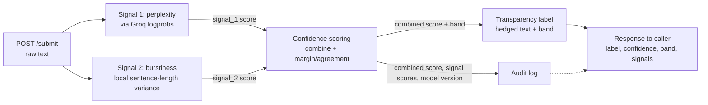
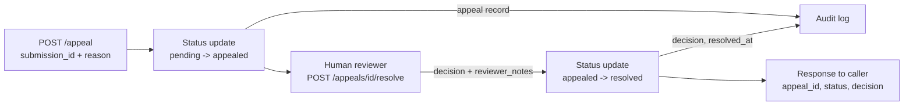

# ai201-project4-provenance-guard

Provenance Guard is a service that scores submitted text for likely AI involvement,
attaches a transparency label, and gives creators a way to appeal a label they
believe is wrong. This document is the Milestone 1 design: detection signals,
the false-positive/appeal reasoning, the API contract, and the architecture
diagram. No detection logic is implemented yet — this is the contract every
later milestone has to satisfy.

## 1. Detection signals

Two independent, cheap-to-compute signals. They're combined later into one
confidence score, but each is designed to fail in a *different* way so one
signal's blind spot doesn't silently become the system's blind spot.

### Signal 1 — Log-probability / perplexity (model-based)

- **What it measures:** How "surprised" a reference LLM (queried via the Groq
  API, using per-token `logprobs`) is by the text — the average negative
  log-probability of the actual tokens under the model's predicted
  distribution. Low perplexity = the text sits in the model's high-probability
  region.
- **Why it differs human vs. AI:** AI text is *literally sampled* from a
  language model's distribution, so by construction it tends to stay in
  high-probability, low-surprise territory. Human writing has idiosyncratic
  word choice, mid-thought pivots, typos, and rare phrasing that push
  probability down and perplexity up.
- **Blind spot:** Perplexity is relative to whichever model scores it, not an
  absolute property of "humanness." Formulaic human text — legal boilerplate,
  non-native-English academic writing, templated technical docs — is also
  highly predictable and will score *low perplexity* even though a person
  wrote it. This signal alone will false-positive on exactly that population.
  It's also trivially defeated by asking the generating model to use an
  unusual style or by light human editing afterward.

### Signal 2 — Burstiness (sentence-length variance, structural)

- **What it measures:** The variance/standard deviation of sentence length
  (and optionally paragraph length) across the document — how much the
  rhythm of the writing fluctuates. Computed locally, no API call.
- **Why it differs human vs. AI:** Human writing mirrors thought: short
  fragments next to long meandering sentences, asides, corrections. A single
  LLM generation pass tends to produce more uniform sentence construction
  because each sentence is generated under similar local constraints and
  decoding settings.
- **Blind spot:** Same failure population as Signal 1 — technical writing,
  legal contracts, and non-native speakers following a template are
  naturally *low-burstiness* even when human-written. It's also purely
  syntactic: it looks at sentence shape, not meaning, so it can't tell
  AI-drafted-then-heavily-edited text from purely human text if the editor
  varies sentence length. And it's easy to defeat by explicitly prompting an
  LLM to vary sentence length.

**Design consequence:** both signals share the same false-positive
population (formulaic / non-native / domain-constrained human writers).
Combining them does not cancel that risk — it can compound it. This is why
confidence scoring and the appeal path (below) exist as first-class parts of
the system, not an afterthought.

## 2. False-positive walkthrough

Scenario: a non-native English speaker submits a genuinely human-written,
formulaic technical report. Signal 1 sees low perplexity (predictable
phrasing). Signal 2 sees low burstiness (uniform sentence length). Both
signals point the same wrong direction — this is the case the design has to
survive.

Trace through the system:

1. **Confidence score** — must never collapse to a single binary bit. Store
   the two raw signal scores *and* a combined score, and treat a case where
   both signals are only mildly over threshold (rather than overwhelmingly
   so) as **low-confidence**, not high-confidence-positive. Confidence
   reflects margin/agreement between signals, not just the combined score.
2. **Label** — must be hedged and probabilistic, never an assertion of fact:
   e.g. `"Signals suggest possible AI involvement (confidence: medium)"`,
   not `"This text is AI-generated."` A three-tier label
   (`likely-human` / `uncertain` / `likely-ai-assisted`) instead of a binary
   AI/human avoids manufacturing false certainty out of a shaky signal.
3. **Audit log** — every submission logs both raw signal scores, the
   combined score, the model/version used for Signal 1, and a timestamp —
   enough for a human reviewer to reconstruct *why* the label was given, not
   just what the label was.
4. **Appeal** — the creator files an appeal referencing the submission and an
   explanation. Critically, the appeal is **not** resolved by re-running the
   same two signals (that would just reproduce the same false positive) —
   it flips the submission to an `appealed` status and requires a human
   reviewer decision. The original algorithmic score/label stays visible
   (transparency), but the reviewer's resolution is a separate field that
   overrides what's *shown* to consumers of the label.

This is why Milestone 2 needs: a continuous confidence score with an
explicit uncertainty band, hedged label copy, a full audit-log schema, and
an appeal status machine that terminates in human adjudication rather than
another automated score.

## 3. API surface

| Endpoint | Method | Accepts | Returns |
|---|---|---|---|
| `/submit` | POST | `{ text, creator_id?, metadata? }` | `{ submission_id, label, confidence, band, signals: { perplexity, burstiness }, created_at }` |
| `/submissions/<id>` | GET | — | same shape as `/submit` response, current state |
| `/submissions/<id>/audit` | GET | — | `{ submission_id, signal_scores, combined_score, model_version, label_history[], timestamps }` |
| `/appeal` | POST | `{ submission_id, reason, evidence? }` | `{ appeal_id, submission_id, status: "pending", submitted_at }` |
| `/appeals/<id>` | GET | — | `{ appeal_id, submission_id, status, reviewer_notes?, resolved_at? }` |
| `/appeals/<id>/resolve` | POST (reviewer-only) | `{ decision: "upheld" \| "overturned", reviewer_notes }` | `{ appeal_id, status: "resolved", decision, resolved_at }` |

Notes:
- `band` is the uncertainty tier (`likely-human` / `uncertain` / `likely-ai-assisted`), kept separate from the raw `confidence` float so the UI never has to invent hedging language itself.
- `/appeals/<id>/resolve` is the one place a human overrides an algorithmic label; it must never be reachable by the same code path that computes signals.
- `flask-limiter` rate-limits `/submit` (and probably `/appeal`) to keep the Groq-backed signal from being spammed.

## 4. Architecture diagram

### Submission flow

### Appeal flow

